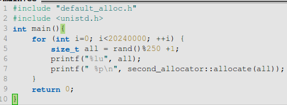
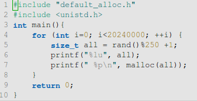
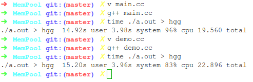
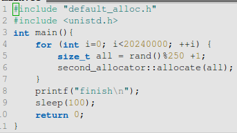
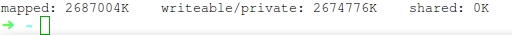
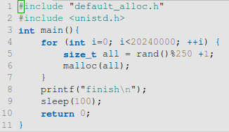
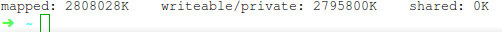

#STL(SGI)内存池性能的测试
这里的测试代码就是同一目录下的main.cc 
demo.cc，这里截图直观的分析: 
main.cc: 
  

demo.cc: 
 

运行时间的对比: 
 

#STL(SGI)内存池内存的利用
测试代码: 
main.cc: 
 
 
demo.cc: 
 
 
从图中可以看出，不仅在时间上节省了几秒， 
更多的是在内存上节约了有10%

